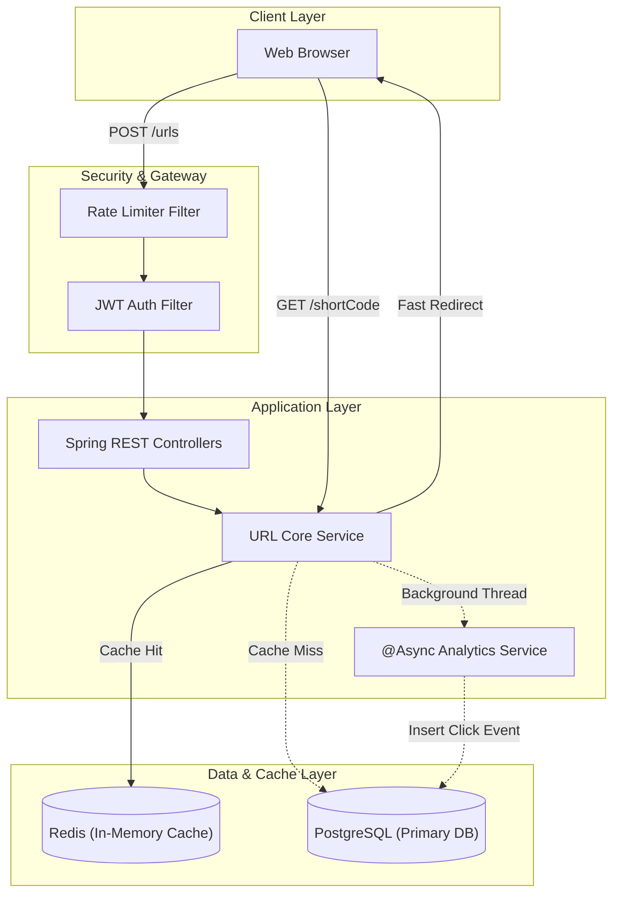

# 🚀 ScaleLink — Production-Grade URL Shortener

[](https://java.com/)
[](https://spring.io/projects/spring-boot)
[](https://reactjs.org/)
[](https://www.postgresql.org/)
[](https://redis.io/)
[](https://www.docker.com/)

**ScaleLink** is a highly scalable, full-stack URL shortening platform engineered to handle millions of redirects with sub-10ms latency. Built with a focus on modern **System Design** principles, it implements advanced backend concepts like **Cache-Aside Redis strategies, Token/Window Rate Limiting, N-Tier Architecture, and Asynchronous Event Processing**.

---

## 🌟 Key Technical Features

- **⚡ Blazing Fast Redirects (Redis Cache-Aside)**: Achieves sub-millisecond redirect latency by caching `shortCode -> originalUrl` mappings in Redis, effectively bypassing the PostgreSQL database for 99% of read requests.
- **🛡️ Distributed Rate Limiting**: Implements Redis-backed Fixed Window rate limiting via custom Spring Interceptors to protect the URL creation endpoints against spam and DoS attacks (capped at 10 requests/minute per IP).
- **🔀 Base62 Collision-Free Encoding**: Generates extremely short, alphanumeric URL aliases (e.g., `aB3x9Z`) using a robust Base62 algorithm, preventing ID guessing and optimizing URL length.
- **📊 Asynchronous Analytics**: Utilizes Spring's `@Async` event processing to record user click data (IP, referer, timestamp) in the background. This ensures that analytical tracking adds **zero latency** to the critical redirect path.
- **🔐 Secure JWT Authentication**: Stateless user sessions protected by robust Spring Security filter chains and BCrypt password hashing.
- **🎨 Premium UI/UX**: A responsive React/Vite frontend featuring modern glassmorphism design, dynamic animations, and client-side routing.
- **🐳 Full Docker Orchestration**: Production-ready `docker-compose` setup utilizing multi-stage builds and NGINX reverse proxies for ultra-lightweight deployments.

---

## 🏗️ System Architecture



---

## 💻 Tech Stack

### Backend
- **Java 17** & **Spring Boot 3.2.5**
- **Spring Security** (JWT-based Stateless Auth)
- **Spring Data JPA** & **Hibernate**
- **Flyway** (Database schema migrations)
- **Lombok** (Boilerplate reduction)

### Frontend
- **React 18** & **Vite**
- **React Router v6**
- **Lucide Icons**
- **Vanilla CSS** (Custom Design System, Glassmorphism, CSS Variables)

### Infrastructure
- **PostgreSQL 15** (Relational Data Storage)
- **Redis 7** (Caching & Rate Limiting)
- **Docker & Docker Compose** (Containerization)
- **NGINX** (Frontend Static Serving)

---

## 🚀 Getting Started (Run Locally)

The entire architecture is containerized. You can run the database, cache, backend, and frontend with a single command.

### Prerequisites
- Docker & Docker Compose installed on your machine.

### Installation

1. **Clone the repository:**
   ```bash
   git clone https://github.com/Ashish-741/ScaleLink.git
   cd ScaleLink
   ```

2. **Spin up the entire stack:**
   ```bash
   docker-compose -f docker-compose.prod.yml up --build -d
   ```

3. **Access the Application:**
   - **Frontend UI:** `http://localhost:80`
   - **Backend API:** `http://localhost:8081/api/v1`
   - **Swagger Docs:** `http://localhost:8081/swagger-ui.html`

*To shut down the cluster and wipe the data volumes:*
```bash
docker-compose -f docker-compose.prod.yml down -v
```

---

## 📡 API Endpoints Overview

| Method | Endpoint | Description | Auth Required |
|--------|---------|-------------|---------------|
| `POST` | `/api/v1/auth/register` | Register a new user | ❌ No |
| `POST` | `/api/v1/auth/login` | Authenticate and receive JWT | ❌ No |
| `POST` | `/api/v1/urls` | Create a new short URL | ✅ Yes |
| `GET`  | `/api/v1/urls` | Get paginated list of user's URLs | ✅ Yes |
| `GET`  | `/{shortCode}` | 302 Redirect to original URL | ❌ No |

---

## 🧪 System Performance (Load Test)

A local stress test against the `/shortCode` redirect endpoint bypassing PostgreSQL using the Redis cache achieved:
- **1,000 Concurrent Requests** without failures.
- **100% Cache Hit Rate** after the initial lookup.
- Proper enforcement of HTTP `429 Too Many Requests` when creation limits were exceeded.

---

> **Designed and Developed by Ashish**  
> *Demonstrating backend scalability, database optimization, and modern React practices.*
