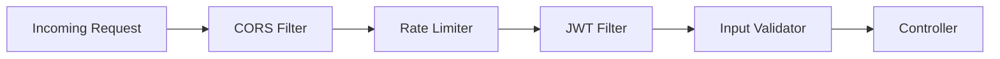
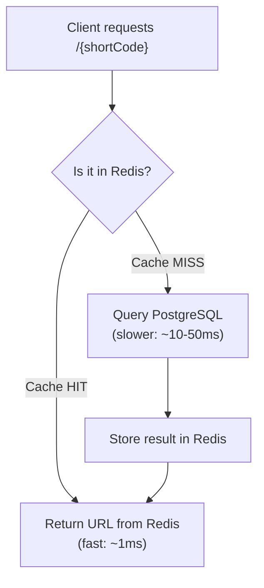
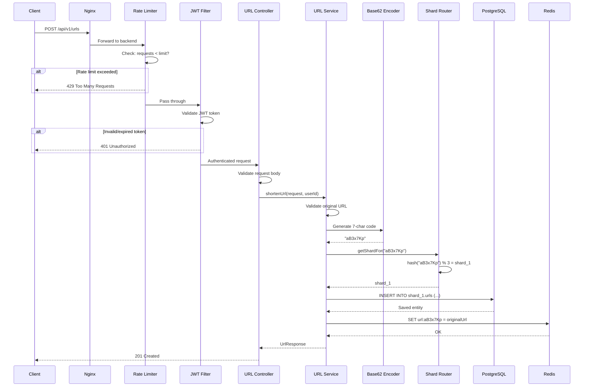
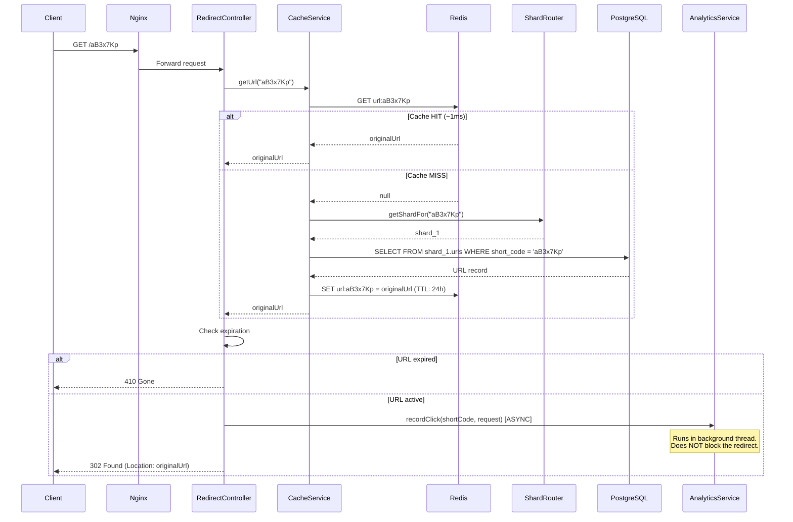
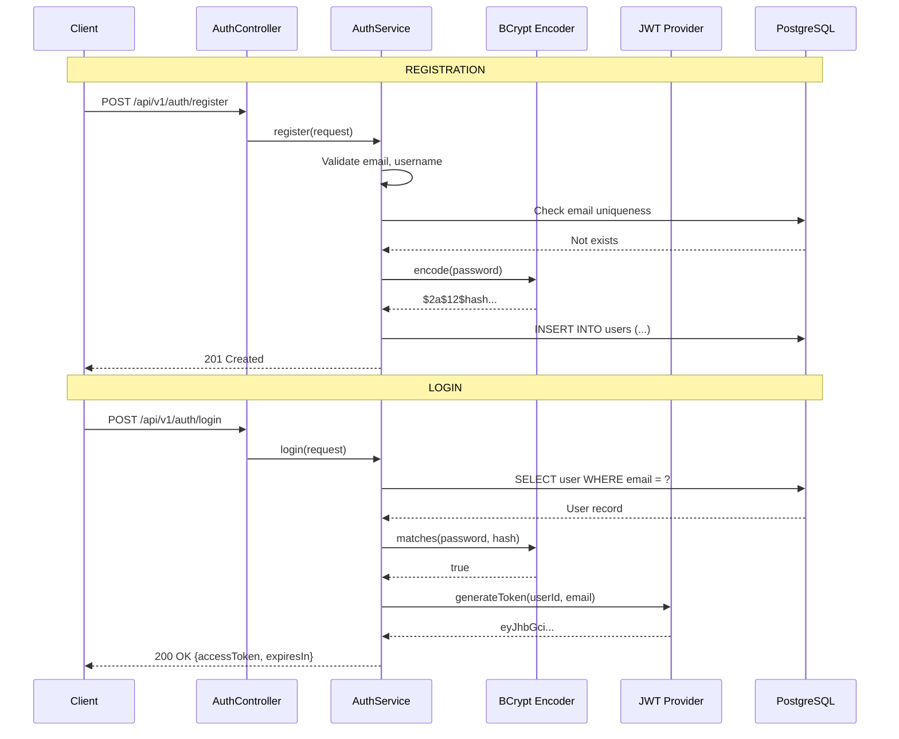
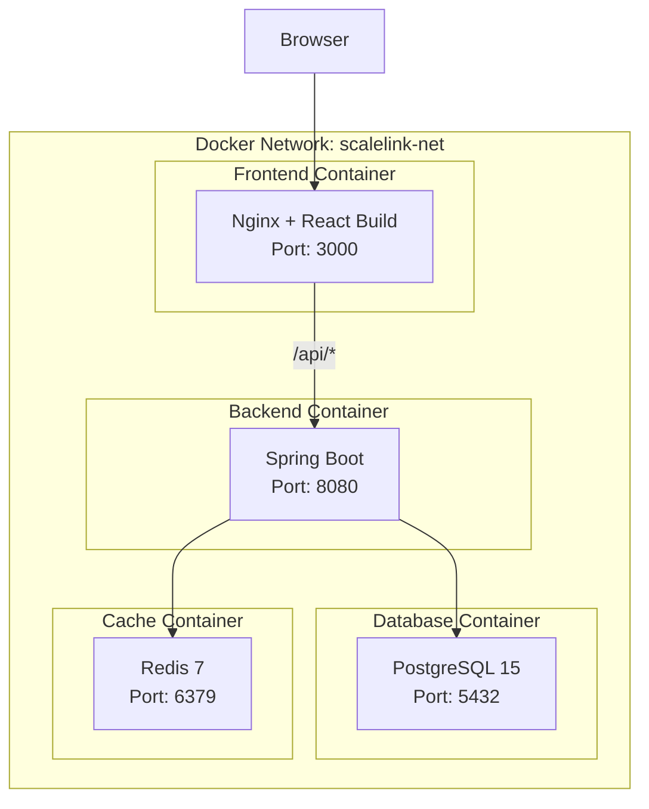
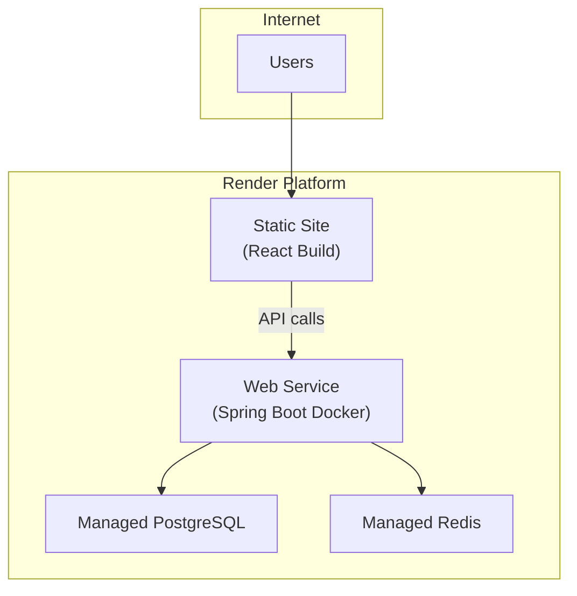

# ScaleLink — High-Level Design (HLD)

> **Document Version**: 1.0
> **Author**: ScaleLink Engineering Team
> **Last Updated**: 2026-06-02

---

## 1. What is HLD?

A High-Level Design is the **bird's-eye view** of the system. It answers:
- What are the major components?
- How do they communicate?
- What technology does each component use?
- How does data flow through the system?

In real companies, the HLD is the first document a Staff/Principal Engineer
produces before any code is written. It's reviewed by the architecture team
and must be approved before development begins.

**In interviews**, the HLD is what you draw on the whiteboard when asked
"Design a URL shortener."

---

## 2. System Architecture

```mermaid
graph TB
    subgraph Clients["Client Layer"]
        ReactApp["React Frontend<br/>(Tailwind CSS)"]
        MobileApp["Mobile / API Clients"]
        ThirdParty["Third-Party Integrations"]
    end

    subgraph LB["Load Balancer Layer"]
        Nginx["Nginx Reverse Proxy<br/>(Load Balancing + SSL Termination)"]
    end

    subgraph AppLayer["Application Layer (Stateless)"]
        App1["Spring Boot Instance 1"]
        App2["Spring Boot Instance 2"]
        App3["Spring Boot Instance N..."]
    end

    subgraph Security["Security Layer (within each instance)"]
        CORS["CORS Filter"]
        RateLimit["Rate Limiter<br/>(Redis-backed)"]
        JWTFilter["JWT Auth Filter"]
        Validation["Input Validation"]
    end

    subgraph Services["Service Layer (within each instance)"]
        AuthSvc["Auth Service"]
        URLSvc["URL Service"]
        RedirectSvc["Redirect Service"]
        AnalyticsSvc["Analytics Service"]
        QRSvc["QR Code Service"]
        CacheSvc["Cache Service"]
        ShardSvc["Shard Router"]
    end

    subgraph CacheLayer["Cache Layer"]
        Redis["Redis<br/>(URL Lookup Cache +<br/>Rate Limit Counters +<br/>Session Blacklist)"]
    end

    subgraph DataLayer["Data Layer"]
        PG_Primary["PostgreSQL Primary<br/>(Read + Write)"]
        PG_Replica["PostgreSQL Replica<br/>(Read-only, conceptual)"]
    end

    subgraph ShardLayer["Shard Layer (Simulation)"]
        Shard0["Schema: shard_0"]
        Shard1["Schema: shard_1"]
        Shard2["Schema: shard_2"]
    end

    subgraph Observability["Observability Layer"]
        Actuator["Spring Actuator<br/>(Health + Metrics)"]
        Logging["Structured Logging<br/>(JSON / Logback)"]
    end

    Clients --> LB
    LB --> AppLayer
    AppLayer --> Security
    Security --> Services
    Services --> CacheLayer
    Services --> DataLayer
    Services --> ShardLayer
    Services --> Observability
    CacheLayer -.->|cache miss| DataLayer
    PG_Primary -.->|replication<br/>(conceptual)| PG_Replica
    PG_Primary --> ShardLayer
```

---

## 3. Component Descriptions

### 3.1 Client Layer

| Component | Technology | Responsibility |
|---|---|---|
| React Frontend | React 18, Tailwind CSS, Axios | User interface — dashboard, URL creation, analytics charts |
| API Clients | Any HTTP client | External integrations via REST API |

**Design Decision**: Frontend is a **Single Page Application (SPA)** served
as static files via Nginx. It communicates with the backend exclusively
through REST APIs. This decouples frontend and backend completely.

### 3.2 Load Balancer / Reverse Proxy

| Component | Technology | Responsibility |
|---|---|---|
| Nginx | Nginx 1.25+ | SSL termination, load balancing, static file serving, request routing |

**Why Nginx?**
- Routes `/api/*` requests to the Spring Boot backend
- Serves the React build files directly (fast static file serving)
- Can load-balance across multiple backend instances (round-robin)
- Handles SSL/TLS termination so backend doesn't need to

**Routing Rules**:
```
/              → React SPA (static files)
/api/v1/*      → Spring Boot backend
/{shortCode}   → Spring Boot backend (redirect)
/actuator/*    → Spring Boot backend (monitoring)
```

### 3.3 Application Layer (Spring Boot)

| Component | Technology | Responsibility |
|---|---|---|
| Spring Boot | Java 17, Spring Boot 3.x | REST API server, business logic |

**Key Design Principle — Statelessness**:

The backend is **completely stateless**. No server-side sessions. All auth
state lives in the JWT token. This means:
- Any instance can handle any request
- We can add/remove instances freely (horizontal scaling)
- No sticky sessions needed on the load balancer
- Crashes don't lose user state

### 3.4 Security Layer

The security layer is a **filter chain** — every request passes through
each filter in order:



| Filter | Purpose |
|---|---|
| CORS Filter | Allows requests only from whitelisted frontend domain |
| Rate Limiter | Rejects requests exceeding rate limits (429) |
| JWT Filter | Validates token, extracts user identity, sets security context |
| Input Validator | Validates request bodies (Bean Validation / @Valid) |

### 3.5 Service Layer

| Service | Responsibility |
|---|---|
| AuthService | Registration, login, JWT generation, password hashing |
| UrlService | CRUD operations on URLs, short code generation (Base62) |
| RedirectService | Resolves short code → original URL, handles expiration |
| AnalyticsService | Click tracking, aggregation, dashboard data |
| CacheService | Redis get/set/invalidate for URL mappings |
| QrCodeService | QR code image generation |
| ShardRouter | Determines which shard a short code belongs to |

### 3.6 Cache Layer (Redis)

Redis serves **three purposes** in ScaleLink:

| Purpose | Key Pattern | TTL |
|---|---|---|
| URL Lookup Cache | `url:{shortCode}` → `{originalUrl}` | 24 hours |
| Rate Limit Counters | `rate:{userId}:{window}` → `{count}` | 1 minute |
| Token Blacklist | `blacklist:{tokenId}` → `true` | Until token expiry |

**Caching Pattern — Cache-Aside (Lazy Loading)**:



### 3.7 Data Layer (PostgreSQL)

| Concept | Implementation |
|---|---|
| Primary Database | All reads and writes |
| Read Replica | Conceptual — documented for interview discussion |
| Sharding | Simulated using separate PostgreSQL schemas |
| Migrations | Flyway versioned migrations |

---

## 4. Data Flow Diagrams

### 4.1 URL Creation Flow



### 4.2 URL Redirect Flow (The Critical Path)



> **Critical Design Decision**: Click recording is **asynchronous**. The user
> gets their redirect immediately. Analytics are recorded in the background.
> This is how Bitly achieves sub-50ms redirects.

### 4.3 Authentication Flow



---

## 5. Deployment Architecture

### 5.1 Local Development (Docker Compose)



### 5.2 Production (Render)



---

## 6. Technology Justification

| Decision | Choice | Why | Alternatives Considered |
|---|---|---|---|
| Language | Java 17 | Enterprise standard, strong typing, excellent tooling, JVM performance | Python, Go, Node.js |
| Framework | Spring Boot 3.x | Industry standard for Java backends, massive ecosystem, production-proven | Quarkus, Micronaut |
| Auth | JWT (HS256) | Stateless, scalable, works with any client | Session cookies, OAuth2 |
| Database | PostgreSQL | ACID compliance, rich indexing, JSON support, free | MySQL, MongoDB |
| Cache | Redis | Sub-millisecond reads, built-in TTL, pub/sub, rate limiting support | Memcached, Caffeine |
| Frontend | React + Tailwind | Component-based, huge ecosystem, rapid UI development | Vue, Angular, Svelte |
| Containerization | Docker + Compose | Reproducible environments, easy local dev, industry standard | Podman, LXC |
| Build | Maven | Standard for Java, dependency management, lifecycle plugins | Gradle |
| Migrations | Flyway | Version-controlled DB schema, rollback support | Liquibase |

---

## 7. Cross-Cutting Concerns

### 7.1 Error Handling
- Global `@ControllerAdvice` exception handler
- Consistent error response format across all endpoints
- Custom exception classes for business errors

### 7.2 Logging
- Structured JSON logging in production (Logback + Logstash encoder)
- Request/response logging via filter
- Correlation ID for request tracing

### 7.3 Monitoring
- Spring Actuator for health checks and metrics
- Micrometer for custom metrics (cache hit ratio, redirect latency)
- `/actuator/health` for uptime monitoring

### 7.4 Configuration
- Spring profiles: `dev`, `prod`
- Environment variables for secrets (DB password, JWT secret)
- `application.yml` for non-sensitive defaults
