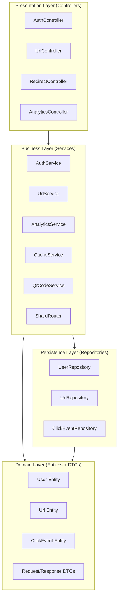
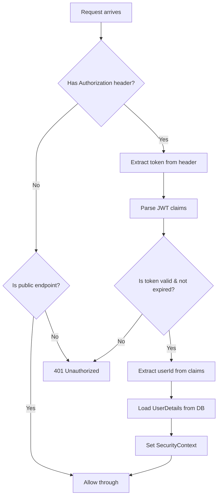
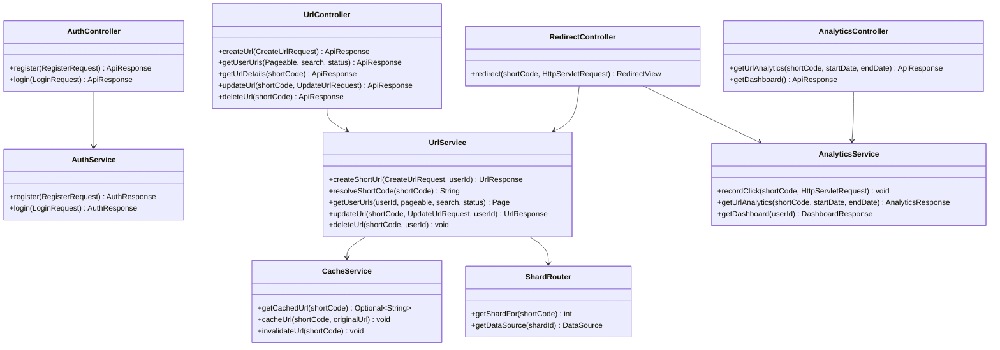

# ScaleLink — Low-Level Design (LLD)

> **Document Version**: 1.0
> **Author**: ScaleLink Engineering Team
> **Last Updated**: 2026-06-02

---

## 1. What is LLD?

While HLD shows the **bird's-eye view**, LLD zooms into the **code-level
design**. It defines:
- Class structures and relationships
- Method signatures
- Design patterns used
- Data structures and algorithms
- Interface contracts

In interviews, LLD questions sound like: "Design the classes for a URL
shortener" or "How would you implement the redirect service?"

---

## 2. Package Structure & Layered Architecture

ScaleLink follows the **Layered Architecture** pattern (also called N-Tier):



### Why Layered Architecture?

- **Separation of Concerns**: Each layer has one responsibility
- **Testability**: Mock one layer to test another
- **Maintainability**: Changes in one layer don't ripple through others
- **Industry Standard**: This is how 90% of Spring Boot apps are structured

### The Rule: Dependencies Flow Downward Only

```
Controller → Service → Repository → Entity
     ↓            ↓
    DTO          DTO
```

A Controller NEVER calls a Repository directly.
A Service NEVER returns an Entity to a Controller — it returns a DTO.

---

## 3. Entity Design (Domain Objects)

### 3.1 User Entity

```java
@Entity
@Table(name = "users")
public class User {

    @Id
    @GeneratedValue(strategy = GenerationType.IDENTITY)
    private Long id;

    @Column(unique = true, nullable = false, length = 100)
    private String email;

    @Column(unique = true, nullable = false, length = 50)
    private String username;

    @Column(name = "password_hash", nullable = false)
    private String passwordHash;

    @Column(name = "is_active", nullable = false)
    private Boolean isActive = true;

    @Column(name = "created_at", nullable = false, updatable = false)
    private LocalDateTime createdAt;

    @Column(name = "updated_at")
    private LocalDateTime updatedAt;

    // One user can have many URLs
    @OneToMany(mappedBy = "user", cascade = CascadeType.ALL, fetch = FetchType.LAZY)
    private List<Url> urls = new ArrayList<>();

    @PrePersist
    protected void onCreate() {
        createdAt = LocalDateTime.now();
        updatedAt = LocalDateTime.now();
    }

    @PreUpdate
    protected void onUpdate() {
        updatedAt = LocalDateTime.now();
    }
}
```

**Key Decisions**:
- `@GeneratedValue(IDENTITY)` — database generates IDs (auto-increment)
- `FetchType.LAZY` — URLs are NOT loaded when we fetch a user (performance)
- `@PrePersist` / `@PreUpdate` — timestamps are set automatically
- Password is stored as `passwordHash`, never plaintext

### 3.2 Url Entity

```java
@Entity
@Table(name = "urls", indexes = {
    @Index(name = "idx_short_code", columnList = "short_code", unique = true),
    @Index(name = "idx_custom_alias", columnList = "custom_alias", unique = true),
    @Index(name = "idx_user_id", columnList = "user_id"),
    @Index(name = "idx_created_at", columnList = "created_at"),
    @Index(name = "idx_expires_at", columnList = "expires_at")
})
public class Url {

    @Id
    @GeneratedValue(strategy = GenerationType.IDENTITY)
    private Long id;

    @Column(name = "short_code", unique = true, nullable = false, length = 10)
    private String shortCode;

    @Column(name = "original_url", nullable = false, columnDefinition = "TEXT")
    private String originalUrl;

    @Column(name = "custom_alias", unique = true, length = 30)
    private String customAlias;

    @ManyToOne(fetch = FetchType.LAZY)
    @JoinColumn(name = "user_id", nullable = false)
    private User user;

    @Column(name = "is_active", nullable = false)
    private Boolean isActive = true;

    @Column(name = "expires_at")
    private LocalDateTime expiresAt;

    @Column(name = "click_count", nullable = false)
    private Long clickCount = 0L;

    @Column(name = "created_at", nullable = false, updatable = false)
    private LocalDateTime createdAt;

    @Column(name = "updated_at")
    private LocalDateTime updatedAt;

    // One URL can have many click events
    @OneToMany(mappedBy = "url", cascade = CascadeType.ALL, fetch = FetchType.LAZY)
    private List<ClickEvent> clickEvents = new ArrayList<>();

    // --- Helper Methods ---

    public boolean isExpired() {
        return expiresAt != null && LocalDateTime.now().isAfter(expiresAt);
    }

    public void incrementClickCount() {
        this.clickCount++;
    }
}
```

**Key Decisions**:
- `short_code` has a UNIQUE index — this is our primary lookup key
- `custom_alias` also has a UNIQUE index — optional but must be unique if set
- `user_id` index for "list all my URLs" queries
- `click_count` is denormalized — we store it here for fast dashboard queries
  instead of counting click_events every time (aggregation pattern)
- `TEXT` type for `original_url` — URLs can be very long

### 3.3 ClickEvent Entity

```java
@Entity
@Table(name = "click_events", indexes = {
    @Index(name = "idx_click_url_id", columnList = "url_id"),
    @Index(name = "idx_click_clicked_at", columnList = "clicked_at"),
    @Index(name = "idx_click_url_date", columnList = "url_id, clicked_at")
})
public class ClickEvent {

    @Id
    @GeneratedValue(strategy = GenerationType.IDENTITY)
    private Long id;

    @ManyToOne(fetch = FetchType.LAZY)
    @JoinColumn(name = "url_id", nullable = false)
    private Url url;

    @Column(name = "ip_address", length = 45)
    private String ipAddress;

    @Column(name = "user_agent", columnDefinition = "TEXT")
    private String userAgent;

    @Column(length = 500)
    private String referrer;

    @Column(length = 100)
    private String country;

    @Column(name = "device_type", length = 20)
    private String deviceType; // "mobile", "desktop", "tablet"

    @Column(name = "clicked_at", nullable = false, updatable = false)
    private LocalDateTime clickedAt;

    @PrePersist
    protected void onCreate() {
        clickedAt = LocalDateTime.now();
    }
}
```

**Key Decisions**:
- Composite index on `(url_id, clicked_at)` — optimizes the most common query:
  "Give me clicks for URL X in the last 7 days"
- `ip_address` is `VARCHAR(45)` — supports IPv6 (max 45 chars)
- No `@OneToMany` back-reference from Url — we don't want to accidentally
  load millions of click events when fetching a URL

---

## 4. DTO Design (Data Transfer Objects)

### Why DTOs?

**Never expose your entities directly to the API.** Reasons:
1. **Security**: Entity may contain `passwordHash` — you don't want to leak it
2. **Decoupling**: API format can evolve independently from DB schema
3. **Validation**: DTOs carry validation annotations (`@NotBlank`, `@Email`)
4. **Performance**: DTOs contain only the fields the client needs

### 4.1 Request DTOs

```java
// RegisterRequest.java
public class RegisterRequest {
    @NotBlank(message = "Username is required")
    @Size(min = 3, max = 20, message = "Username must be 3-20 characters")
    @Pattern(regexp = "^[a-zA-Z0-9_]+$", message = "Username can only contain letters, numbers, underscores")
    private String username;

    @NotBlank(message = "Email is required")
    @Email(message = "Invalid email format")
    private String email;

    @NotBlank(message = "Password is required")
    @Size(min = 8, message = "Password must be at least 8 characters")
    private String password;
}

// LoginRequest.java
public class LoginRequest {
    @NotBlank(message = "Email is required")
    @Email(message = "Invalid email format")
    private String email;

    @NotBlank(message = "Password is required")
    private String password;
}

// CreateUrlRequest.java
public class CreateUrlRequest {
    @NotBlank(message = "Original URL is required")
    @org.hibernate.validator.constraints.URL(message = "Invalid URL format")
    private String originalUrl;

    @Size(min = 3, max = 30, message = "Alias must be 3-30 characters")
    @Pattern(regexp = "^[a-zA-Z0-9-]+$", message = "Alias can only contain letters, numbers, hyphens")
    private String customAlias; // optional

    @Future(message = "Expiration must be in the future")
    private LocalDateTime expiresAt; // optional
}

// UpdateUrlRequest.java
public class UpdateUrlRequest {
    @org.hibernate.validator.constraints.URL(message = "Invalid URL format")
    private String originalUrl;

    @Future(message = "Expiration must be in the future")
    private LocalDateTime expiresAt;

    private Boolean isActive;
}
```

### 4.2 Response DTOs

```java
// ApiResponse.java — Universal response envelope
public class ApiResponse<T> {
    private boolean success;
    private String message;
    private T data;
    private List<FieldError> errors;
    private LocalDateTime timestamp;

    // Static factory methods for clean usage
    public static <T> ApiResponse<T> success(String message, T data) { ... }
    public static <T> ApiResponse<T> error(String message, List<FieldError> errors) { ... }
}

// AuthResponse.java
public class AuthResponse {
    private String accessToken;
    private String tokenType = "Bearer";
    private long expiresIn;
    private UserSummary user;
}

// UrlResponse.java
public class UrlResponse {
    private Long id;
    private String shortCode;
    private String shortUrl;
    private String originalUrl;
    private String customAlias;
    private LocalDateTime expiresAt;
    private Long clickCount;
    private Boolean isActive;
    private LocalDateTime createdAt;
}

// AnalyticsResponse.java
public class AnalyticsResponse {
    private String shortCode;
    private Long totalClicks;
    private Long uniqueClicks;
    private List<DailyClickCount> dailyClicks;
    private List<ReferrerCount> topReferrers;
    private List<DeviceCount> deviceBreakdown;
}
```

---

## 5. Service Layer Design

### 5.1 UrlService — The Core Service

```java
@Service
@Transactional
public class UrlService {

    // Dependencies injected via constructor
    private final UrlRepository urlRepository;
    private final CacheService cacheService;
    private final ShardRouter shardRouter;
    private final Base62Encoder base62Encoder;

    // --- Public API ---

    public UrlResponse createShortUrl(CreateUrlRequest request, Long userId);
    public String resolveShortCode(String shortCode);
    public UrlResponse getUrlDetails(String shortCode, Long userId);
    public Page<UrlResponse> getUserUrls(Long userId, Pageable pageable, String search, String status);
    public UrlResponse updateUrl(String shortCode, UpdateUrlRequest request, Long userId);
    public void deleteUrl(String shortCode, Long userId);

    // --- Private Helpers ---

    private String generateUniqueShortCode();
    private void validateUrlOwnership(Url url, Long userId);
    private UrlResponse toResponse(Url url);
}
```

### 5.2 Short Code Generation Algorithm

```java
@Component
public class Base62Encoder {

    private static final String ALPHABET =
        "abcdefghijklmnopqrstuvwxyzABCDEFGHIJKLMNOPQRSTUVWXYZ0123456789";
    private static final int CODE_LENGTH = 7;
    private static final SecureRandom RANDOM = new SecureRandom();

    /**
     * Generates a random 7-character Base62 string.
     *
     * Why random instead of sequential?
     * 1. Sequential IDs are predictable — attackers can enumerate all URLs
     * 2. Random codes don't reveal how many URLs exist
     * 3. SecureRandom is cryptographically strong
     *
     * Collision probability with 62^7 = 3.5 trillion possible codes:
     * After 1 million URLs: ~0.00003% chance of collision
     * We handle collisions by retrying (up to 3 times)
     */
    public String generateShortCode() {
        StringBuilder sb = new StringBuilder(CODE_LENGTH);
        for (int i = 0; i < CODE_LENGTH; i++) {
            sb.append(ALPHABET.charAt(RANDOM.nextInt(ALPHABET.length())));
        }
        return sb.toString();
    }
}
```

### 5.3 Cache Service Design

```java
@Service
public class CacheService {

    private final RedisTemplate<String, String> redisTemplate;
    private static final String URL_CACHE_PREFIX = "url:";
    private static final Duration DEFAULT_TTL = Duration.ofHours(24);

    /**
     * Cache-Aside Pattern:
     * 1. Check cache first
     * 2. If miss, caller queries DB
     * 3. Caller stores result in cache
     * 4. On update/delete, invalidate cache
     */

    public Optional<String> getCachedUrl(String shortCode);
    public void cacheUrl(String shortCode, String originalUrl);
    public void invalidateUrl(String shortCode);
    public void invalidateUrl(String shortCode, String customAlias);
}
```

---

## 6. Design Patterns Used

| Pattern | Where | Why |
|---|---|---|
| **Repository Pattern** | `*Repository` | Abstracts database access behind interfaces |
| **DTO Pattern** | `request/`, `response/` | Decouples API format from entity structure |
| **Factory Method** | `ApiResponse.success()` | Clean object creation with static methods |
| **Strategy Pattern** | `RateLimiter` interface | Swap rate limiting algorithms at runtime |
| **Template Method** | Spring's `OncePerRequestFilter` | Custom filters extend Spring's base filter |
| **Observer (Async)** | `@Async` click recording | Non-blocking event processing |
| **Cache-Aside** | `CacheService` | Lazy-loading cache with invalidation |
| **Builder Pattern** | Response DTOs | Clean construction of complex objects |

---

## 7. Error Handling Design

```java
@RestControllerAdvice
public class GlobalExceptionHandler {

    @ExceptionHandler(ResourceNotFoundException.class)
    @ResponseStatus(HttpStatus.NOT_FOUND)
    public ApiResponse<?> handleNotFound(ResourceNotFoundException ex);

    @ExceptionHandler(DuplicateAliasException.class)
    @ResponseStatus(HttpStatus.CONFLICT)
    public ApiResponse<?> handleDuplicate(DuplicateAliasException ex);

    @ExceptionHandler(UrlExpiredException.class)
    @ResponseStatus(HttpStatus.GONE)
    public ApiResponse<?> handleExpired(UrlExpiredException ex);

    @ExceptionHandler(RateLimitExceededException.class)
    @ResponseStatus(HttpStatus.TOO_MANY_REQUESTS)
    public ApiResponse<?> handleRateLimit(RateLimitExceededException ex);

    @ExceptionHandler(AccessDeniedException.class)
    @ResponseStatus(HttpStatus.FORBIDDEN)
    public ApiResponse<?> handleAccessDenied(AccessDeniedException ex);

    @ExceptionHandler(MethodArgumentNotValidException.class)
    @ResponseStatus(HttpStatus.BAD_REQUEST)
    public ApiResponse<?> handleValidation(MethodArgumentNotValidException ex);

    // Catch-all for unexpected errors
    @ExceptionHandler(Exception.class)
    @ResponseStatus(HttpStatus.INTERNAL_SERVER_ERROR)
    public ApiResponse<?> handleGeneral(Exception ex);
}
```

**Why a global exception handler?**
- Every endpoint returns the same error format — no inconsistencies
- Business logic throws exceptions, doesn't construct error responses
- One place to log all errors
- Clean separation between business logic and error formatting

---

## 8. Security Design

### JWT Authentication Flow (Detailed)



### JWT Token Structure

```
Header:  { "alg": "HS256", "typ": "JWT" }
Payload: { "sub": "1", "email": "ashish@example.com", "iat": 1717329600, "exp": 1717333200 }
Signature: HMACSHA256(base64(header) + "." + base64(payload), SECRET_KEY)
```

---

## 9. Class Diagram


