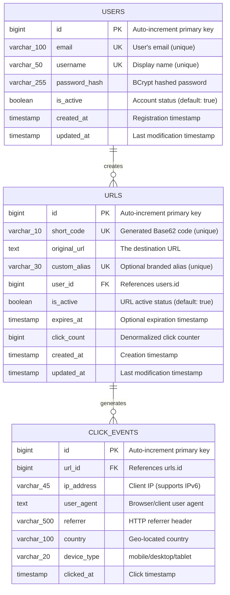

# ScaleLink — Database Design

> **Document Version**: 1.0
> **Database**: PostgreSQL 15+
> **Migration Tool**: Flyway
> **Last Updated**: 2026-06-02

---

## 1. Why Database Design Matters

In interviews, a poorly designed schema is a red flag. A well-designed schema
demonstrates:
- Understanding of **normalization** (avoiding data duplication)
- Understanding of **denormalization** (when to intentionally duplicate for performance)
- **Indexing strategy** (how to make queries fast)
- **Data type selection** (right tool for the job)
- **Constraint design** (enforcing data integrity at the DB level)

> "The database is the foundation. Get it wrong, and everything built on top
> will eventually collapse." — Every senior engineer ever.

---

## 2. Entity-Relationship Diagram



### Relationship Summary

| Relationship | Type | Meaning |
|---|---|---|
| Users → URLs | One-to-Many | One user can create many short URLs |
| URLs → ClickEvents | One-to-Many | One URL can receive many clicks |

---

## 3. Design Decisions Explained

### 3.1 Why `bigint` for Primary Keys?

| Type | Max Value | Enough For? |
|---|---|---|
| `int` (4 bytes) | 2.1 billion | Might run out for click_events |
| `bigint` (8 bytes) | 9.2 quintillion | Effectively unlimited |

At 10M clicks/day, `int` runs out in ~214 days for click_events.
`bigint` lasts billions of years. **Always use `bigint` for tables that grow.**

### 3.2 Why `TEXT` for `original_url`?

- URLs can be extremely long (2,000+ characters)
- `VARCHAR(n)` requires you to pick a max length — risky
- `TEXT` in PostgreSQL has no performance penalty vs `VARCHAR`
- There's a common misconception that `TEXT` is slower — it's not in PostgreSQL

### 3.3 Why Denormalize `click_count` in `urls`?

**Normalized approach** (correct but slow):
```sql
SELECT COUNT(*) FROM click_events WHERE url_id = 42;
-- Scans potentially millions of rows. Slow.
```

**Denormalized approach** (what we do):
```sql
SELECT click_count FROM urls WHERE id = 42;
-- Single column read. Instant.
```

The dashboard shows click counts for every URL. Running `COUNT(*)` on
click_events for every URL on every page load would be disastrous.

**Trade-off**: We must increment `click_count` every time a click is recorded.
If we miss an increment (crash), the count is slightly off. This is acceptable
for a counter that's "for display purposes" — exactness can come from
`COUNT(*)` on click_events when needed (analytics page).

### 3.4 Why `VARCHAR(45)` for IP Address?

- IPv4: max 15 characters (e.g., `255.255.255.255`)
- IPv6: max 45 characters (e.g., `2001:0db8:85a3:0000:0000:8a2e:0370:7334`)
- Future-proofing: always design for IPv6

### 3.5 Why Separate `short_code` and `custom_alias`?

- Every URL gets a `short_code` (system-generated, always exists)
- Only some URLs get a `custom_alias` (user-chosen, optional)
- Both can be used for redirection: `/{shortCode}` or `/{customAlias}`
- They have separate unique constraints
- This avoids confusion and keeps the schema clean

---

## 4. Indexing Strategy

### 4.1 What Are Indexes?

An index is a data structure that speeds up data retrieval. Think of it like
a book's table of contents — instead of reading every page, you jump directly
to the right one.

**Trade-off**: Indexes speed up reads but slow down writes (every INSERT/UPDATE
must also update the index). Only index columns you actually query.

### 4.2 Index Plan

| Table | Index Name | Column(s) | Type | Why |
|---|---|---|---|---|
| users | `pk_users` | id | B-tree (PK) | Primary key lookup |
| users | `uk_users_email` | email | Unique B-tree | Login lookup, uniqueness |
| users | `uk_users_username` | username | Unique B-tree | Uniqueness check |
| urls | `pk_urls` | id | B-tree (PK) | Primary key lookup |
| urls | `uk_urls_short_code` | short_code | Unique B-tree | **THE critical index** — redirect lookup |
| urls | `uk_urls_custom_alias` | custom_alias | Unique B-tree | Alias-based redirect |
| urls | `idx_urls_user_id` | user_id | B-tree | "List all my URLs" query |
| urls | `idx_urls_user_created` | user_id, created_at DESC | Composite B-tree | Dashboard: my URLs sorted by date |
| urls | `idx_urls_user_clicks` | user_id, click_count DESC | Composite B-tree | Dashboard: my top URLs |
| urls | `idx_urls_expires_at` | expires_at | B-tree | Find expired URLs |
| urls | `idx_urls_active` | is_active, user_id | Composite B-tree | Filter active/inactive URLs |
| click_events | `pk_click_events` | id | B-tree (PK) | Primary key lookup |
| click_events | `idx_clicks_url_id` | url_id | B-tree | Analytics: clicks for a URL |
| click_events | `idx_clicks_url_date` | url_id, clicked_at | Composite B-tree | **Key index** — analytics date range queries |
| click_events | `idx_clicks_clicked_at` | clicked_at | B-tree | Time-based analytics queries |

### 4.3 Why Composite Indexes?

A composite index on `(url_id, clicked_at)` is much better than two separate
indexes for this query:

```sql
SELECT COUNT(*) FROM click_events
WHERE url_id = 42 AND clicked_at BETWEEN '2026-06-01' AND '2026-06-07';
```

With the composite index, PostgreSQL can:
1. Jump to `url_id = 42` in the index
2. Scan only the date range within that URL's entries
3. Never touch the actual table (index-only scan)

Two separate indexes would require PostgreSQL to merge results — much slower.

### 4.4 Index Column Order Matters

In `(url_id, clicked_at)`:
- First column (`url_id`) = **equality** condition (`WHERE url_id = 42`)
- Second column (`clicked_at`) = **range** condition (`BETWEEN dates`)

**Rule**: Put equality columns first, range columns last in composite indexes.

---

## 5. Query Patterns & Optimization

### 5.1 Critical Queries (Hot Path)

**Q1: Redirect lookup** (called on every redirect, ~115/sec)
```sql
SELECT original_url, is_active, expires_at
FROM urls
WHERE short_code = $1;
-- Uses: uk_urls_short_code index
-- Expected: < 1ms (index seek)
-- Note: This is cached in Redis. DB hit only on cache miss.
```

**Q2: Redirect by custom alias**
```sql
SELECT original_url, is_active, expires_at, short_code
FROM urls
WHERE custom_alias = $1;
-- Uses: uk_urls_custom_alias index
-- Expected: < 1ms
```

### 5.2 Dashboard Queries

**Q3: List user's URLs (paginated)**
```sql
SELECT id, short_code, original_url, custom_alias, click_count,
       is_active, expires_at, created_at
FROM urls
WHERE user_id = $1
ORDER BY created_at DESC
LIMIT 20 OFFSET 0;
-- Uses: idx_urls_user_created composite index
-- Expected: < 5ms
```

**Q4: User's top URLs**
```sql
SELECT short_code, original_url, click_count
FROM urls
WHERE user_id = $1
ORDER BY click_count DESC
LIMIT 5;
-- Uses: idx_urls_user_clicks composite index
-- Expected: < 5ms
```

**Q5: Search user's URLs**
```sql
SELECT * FROM urls
WHERE user_id = $1
  AND (short_code ILIKE $2 OR original_url ILIKE $2)
ORDER BY created_at DESC
LIMIT 20 OFFSET 0;
-- Note: ILIKE prevents index use on the search columns
-- Acceptable because it's filtered by user_id first (small result set)
```

### 5.3 Analytics Queries

**Q6: Daily click counts for a URL**
```sql
SELECT DATE(clicked_at) as click_date,
       COUNT(*) as total_clicks,
       COUNT(DISTINCT ip_address) as unique_clicks
FROM click_events
WHERE url_id = $1
  AND clicked_at BETWEEN $2 AND $3
GROUP BY DATE(clicked_at)
ORDER BY click_date;
-- Uses: idx_clicks_url_date composite index
-- Expected: < 50ms for 7-day range
```

**Q7: Top referrers for a URL**
```sql
SELECT referrer, COUNT(*) as count
FROM click_events
WHERE url_id = $1
  AND clicked_at BETWEEN $2 AND $3
  AND referrer IS NOT NULL
GROUP BY referrer
ORDER BY count DESC
LIMIT 10;
-- Uses: idx_clicks_url_date composite index
```

**Q8: Device breakdown for a URL**
```sql
SELECT device_type, COUNT(*) as count
FROM click_events
WHERE url_id = $1
  AND clicked_at BETWEEN $2 AND $3
GROUP BY device_type;
-- Uses: idx_clicks_url_date composite index
```

**Q9: Recent activity across all user's URLs**
```sql
SELECT ce.clicked_at, ce.device_type, ce.country, u.short_code
FROM click_events ce
JOIN urls u ON ce.url_id = u.id
WHERE u.user_id = $1
ORDER BY ce.clicked_at DESC
LIMIT 10;
-- Uses: idx_urls_user_id + idx_clicks_clicked_at
```

### 5.4 Maintenance Queries

**Q10: Find expired URLs (for cleanup job)**
```sql
SELECT id, short_code FROM urls
WHERE expires_at IS NOT NULL
  AND expires_at < NOW()
  AND is_active = true;
-- Uses: idx_urls_expires_at
-- Run as a scheduled job (e.g., every hour)
```

---

## 6. Query Optimization Strategies

| Strategy | Where Applied | Impact |
|---|---|---|
| **Composite indexes** | click_events (url_id, clicked_at) | 10x faster analytics queries |
| **Denormalization** | click_count in urls table | Avoid COUNT(*) on dashboard |
| **Pagination** | All list endpoints (LIMIT/OFFSET) | Prevent loading millions of rows |
| **Index-only scans** | Redirect lookup | No table access needed |
| **Async writes** | Click event recording | Redirect latency unaffected by writes |
| **Selective columns** | Only SELECT needed columns | Less data transferred |
| **Connection pooling** | HikariCP (Spring default) | Reuse DB connections |
| **Prepared statements** | JPA parameterized queries | SQL injection prevention + plan caching |

---

## 7. Future Optimization: Table Partitioning

When `click_events` grows to hundreds of millions of rows, we'll partition
by month:

```sql
-- Conceptual (documented for interview discussion)
CREATE TABLE click_events (
    id bigint GENERATED ALWAYS AS IDENTITY,
    url_id bigint NOT NULL,
    clicked_at timestamp NOT NULL,
    ...
) PARTITION BY RANGE (clicked_at);

CREATE TABLE click_events_2026_06 PARTITION OF click_events
    FOR VALUES FROM ('2026-06-01') TO ('2026-07-01');

CREATE TABLE click_events_2026_07 PARTITION OF click_events
    FOR VALUES FROM ('2026-07-01') TO ('2026-08-01');
```

**Benefits**:
- Queries with date ranges only scan relevant partitions
- Old partitions can be archived/dropped without affecting current data
- Each partition can be indexed independently

We don't implement this now (premature optimization for our scale), but it's
important to discuss in interviews.
