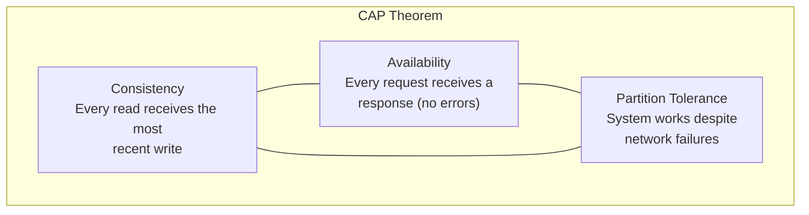
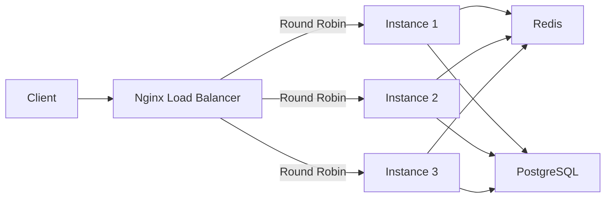
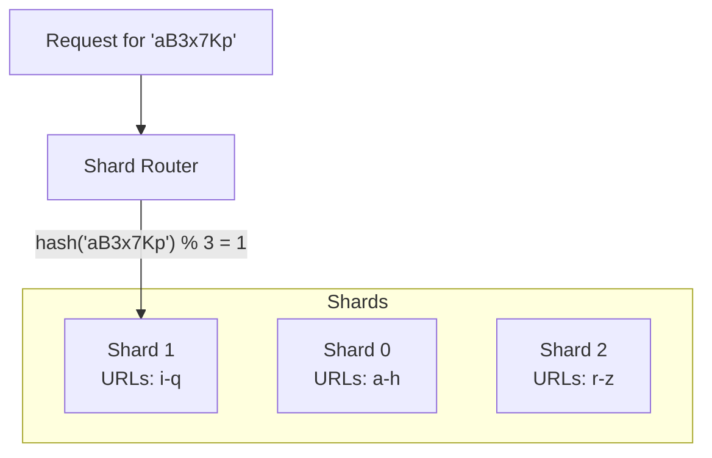
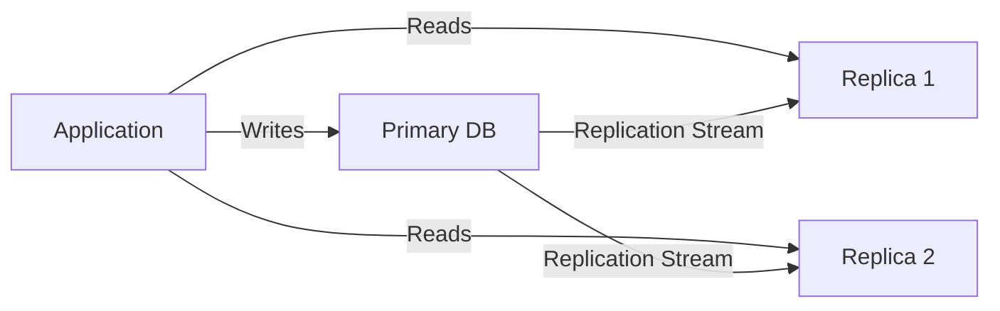

# ScaleLink — System Design Concepts

> **Document Version**: 1.0
> **Purpose**: Deep-dive into system design concepts demonstrated by ScaleLink
> **Last Updated**: 2026-06-02

---

## 1. CAP Theorem

### What Is It?

The CAP theorem states that a distributed system can only guarantee **two out
of three** properties simultaneously:



- **Consistency (C)**: All nodes see the same data at the same time
- **Availability (A)**: Every request gets a response (success or failure)
- **Partition Tolerance (P)**: System continues to operate despite network splits

### ScaleLink's Position: AP with Eventual Consistency

Since network partitions are **inevitable** in distributed systems (P is
non-negotiable), we must choose between C and A:

| Scenario | Our Choice | Why |
|---|---|---|
| URL Redirect | **AP** (Availability) | A redirect serving stale data for a few seconds is better than returning an error. Users can tolerate being redirected to a slightly outdated destination. |
| URL Creation | **CP** (Consistency) | Two users must NOT get the same short code. We need strong consistency for writes. |
| Analytics | **AP** (Availability) | A click count being off by 1-2 for a few seconds is acceptable. |

### How We Achieve Eventual Consistency

1. Redis cache may be slightly stale (24h TTL)
2. When a URL is updated, we invalidate the cache immediately
3. Even if invalidation fails, the stale entry expires within 24 hours
4. This is **eventual consistency** — the system converges to the correct state

---

## 2. Scaling Strategies

### 2.1 Vertical Scaling (Scale Up)

**Definition**: Add more resources (CPU, RAM, disk) to a single machine.

```
Before: 4 CPU, 8 GB RAM, 100 GB SSD
After:  16 CPU, 64 GB RAM, 1 TB SSD
```

**Pros**:
- Simple — no code changes needed
- No distributed system complexity

**Cons**:
- Has a ceiling (can't add infinite hardware)
- Single point of failure
- Expensive at high specs
- Downtime during upgrade

**When to use**: When you're small, before you truly need horizontal scaling.

### 2.2 Horizontal Scaling (Scale Out)

**Definition**: Add more machines to the pool.

```
Before: 1 server handling 100 req/sec
After:  5 servers handling 500 req/sec (with load balancer)
```

**Pros**:
- Theoretically unlimited scaling
- No single point of failure (if designed correctly)
- Use commodity hardware (cheaper per unit)

**Cons**:
- Requires stateless application design
- Need a load balancer
- Distributed system complexity (consistency, coordination)

**ScaleLink's Approach**: Our backend is **stateless** (JWT, no sessions).
We can run N instances behind Nginx and scale horizontally.



---

## 3. Load Balancing

### What Is It?

A load balancer distributes incoming traffic across multiple servers to:
- Prevent any single server from being overwhelmed
- Enable horizontal scaling
- Provide fault tolerance (route around failed servers)

### Algorithms

| Algorithm | How It Works | Best For |
|---|---|---|
| **Round Robin** | Requests go to servers in order: 1→2→3→1→2→3 | Equal-capacity servers |
| **Weighted Round Robin** | Server 1 gets 3x, Server 2 gets 1x (based on capacity) | Mixed-capacity servers |
| **Least Connections** | Send to the server with fewest active connections | Varying request durations |
| **IP Hash** | Hash(client IP) determines server | When you need session affinity |

**ScaleLink uses Round Robin** — since our backend is stateless, any server
can handle any request. No affinity needed.

---

## 4. Database Sharding

### What Is It?

Sharding splits data across multiple databases. Each shard holds a
**subset** of the data.



### Why Sharding Exists

When a single database can't handle the load:
- Too many rows (billions) → queries slow down
- Too many writes → single master bottleneck
- Too much data → storage limits

### Shard Key Selection

**Our shard key**: `shortCode`

```
shard_id = hash(shortCode) % NUMBER_OF_SHARDS
```

**Why `shortCode` and not `userId`?**
- Redirects look up by `shortCode` — this is our hottest query
- Using `shortCode` as shard key means we can route directly to the right shard
- If we sharded by `userId`, a redirect would need to check ALL shards

### ScaleLink's Simulation

We simulate sharding using **PostgreSQL schemas**:

```sql
-- All schemas live in the same PostgreSQL instance
-- but behave as separate logical databases

CREATE SCHEMA shard_0;
CREATE SCHEMA shard_1;
CREATE SCHEMA shard_2;

CREATE TABLE shard_0.urls (LIKE public.urls INCLUDING ALL);
CREATE TABLE shard_1.urls (LIKE public.urls INCLUDING ALL);
CREATE TABLE shard_2.urls (LIKE public.urls INCLUDING ALL);
```

**Benefits of this simulation**:
- Demonstrates the concept without needing multiple DB servers
- Code is identical to what you'd write for real sharding
- Easy to explain in interviews: "I simulated sharding with schemas,
  but the routing logic is production-ready"

### Drawbacks of Sharding

| Drawback | Explanation |
|---|---|
| **Cross-shard queries** | "Get all URLs for user X" may span multiple shards |
| **Rebalancing** | Adding a shard means moving data |
| **Complexity** | Every query must know which shard to hit |
| **Joins** | Can't join across shards easily |
| **Transactions** | ACID across shards requires 2-phase commit |

---

## 5. Database Replication

### What Is It?

Replication copies data from one database (primary) to one or more copies
(replicas):



### Benefits

- **Read scaling**: Spread read load across replicas
- **Availability**: If primary fails, promote a replica
- **Geographic distribution**: Put replicas closer to users

### ScaleLink's Approach

We **document and discuss** replication but don't implement it in our demo
(unnecessary complexity for our scale). This is the right engineering
decision — you don't add complexity you don't need.

In interviews, explain: "At our current scale, a single PostgreSQL with
Redis caching handles the load. If reads exceeded what one DB can serve,
I'd add read replicas and route reads to them."

---

## 6. Caching Strategies

### 6.1 Cache-Aside (Lazy Loading) — What ScaleLink Uses

```
Read:   Check cache → if miss, read DB → store in cache → return
Write:  Write to DB → invalidate cache
```

**Pros**: Only caches what's actually requested (no wasted memory)
**Cons**: First request is always a cache miss (cold start)

### 6.2 Write-Through

```
Write:  Write to cache AND DB simultaneously
Read:   Always read from cache
```

**Pros**: Cache is always up-to-date
**Cons**: Higher write latency, caches data that may never be read

### 6.3 Write-Behind (Write-Back)

```
Write:  Write to cache only → async write to DB later
Read:   Always read from cache
```

**Pros**: Very fast writes
**Cons**: Risk of data loss if cache crashes before DB write

### Why We Chose Cache-Aside

URL shorteners are **read-heavy** (100:1 ratio). Cache-aside:
- Only caches URLs that are actually being accessed (hot data)
- Doesn't waste cache memory on URLs that are never clicked
- Simple to implement and reason about
- Matches the Zipf distribution of URL access patterns

---

## 7. Rate Limiting Algorithms

### 7.1 Fixed Window

Divide time into fixed windows (e.g., 1-minute windows). Count requests
per window. Reject if count exceeds limit.

```
Window: 12:00-12:01 | 12:01-12:02 | 12:02-12:03
Count:     8/10     |    3/10     |    0/10
```

**Problem**: Burst at window boundary. If 10 requests come at 12:00:59 and
10 more at 12:01:01, that's 20 requests in 2 seconds.

### 7.2 Sliding Window

Combines the current window and the previous window, weighted by time
position within the current window.

```
Previous window count: 8
Current window count: 3
Time position: 40% into current window
Effective count: 8 × 0.6 + 3 = 7.8
```

**Solves**: The boundary burst problem of fixed window.

### 7.3 Token Bucket

A bucket holds tokens. Each request consumes one token. Tokens are added
at a fixed rate. If the bucket is empty, request is rejected.

```
Bucket capacity: 10
Refill rate: 1 token/second
Request arrives: bucket has 5 tokens → allow, bucket = 4
Request arrives: bucket has 0 tokens → reject (429)
```

**Allows**: Controlled bursts (up to bucket capacity).

ScaleLink implements **all three** to demonstrate understanding. Users can
switch between them via configuration.

---

## 8. High Availability

### Strategies Demonstrated

| Strategy | Implementation |
|---|---|
| Stateless backend | JWT auth, no server sessions |
| Health checks | Spring Actuator `/actuator/health` |
| Graceful degradation | Works without Redis (falls back to DB) |
| Zero-downtime deploy | Docker rolling updates |
| Data durability | PostgreSQL with WAL (Write-Ahead Log) |

---

## 9. Consistency vs Availability Tradeoffs

| Feature | Consistency Needed? | Availability Needed? | Our Choice |
|---|---|---|---|
| Short code generation | Strong (must be unique) | High | Consistency (DB unique constraint) |
| URL redirect | Eventual (stale for seconds is OK) | Very high | Availability (serve from cache) |
| Click counting | Eventual (off by 1-2 is OK) | High | Availability (async recording) |
| User registration | Strong (unique email) | Medium | Consistency (DB unique constraint) |
| Analytics dashboard | Eventual (aggregated data) | Medium | Availability (pre-aggregated) |
